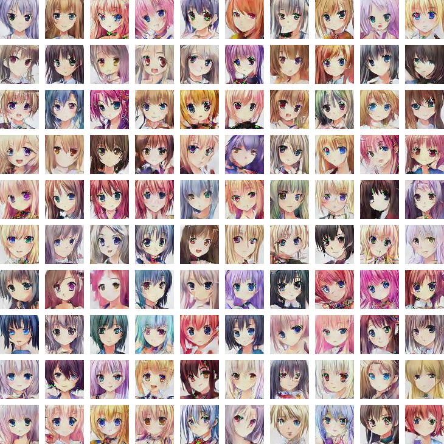

# Simple Animate GAN

A very simple DCGAN to generate animate girls' headshots.

Images generated by the model trained 1000 epochs.



## Dataset

[Anime Faces by Soumik Rakshit](<https://www.kaggle.com/soumikrakshit/anime-faces>)

## Train it by yourself

```shell
python train.py
```

## Generate animate headshots with trained model

```python
python eval.py
```

The generated image can be found at folder `generated/ `.

